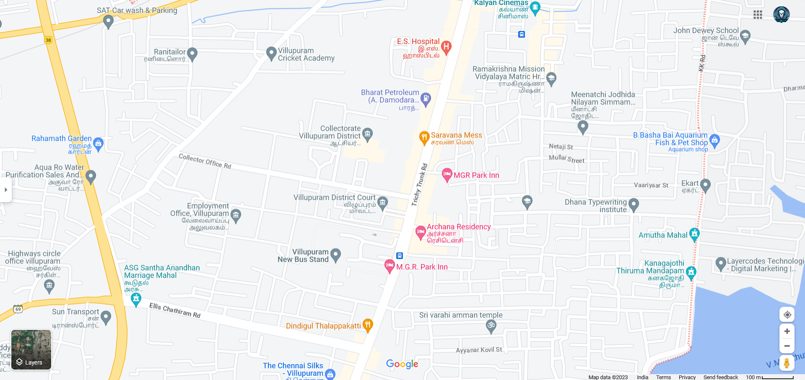
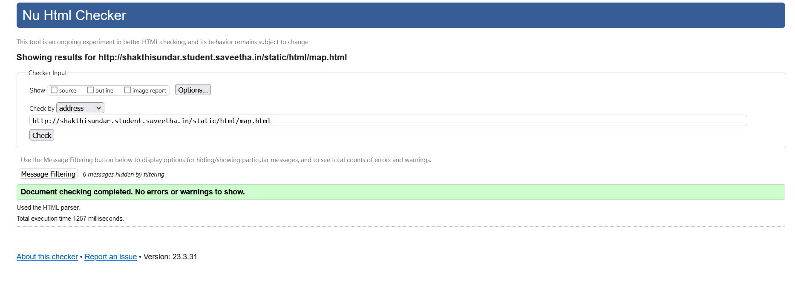
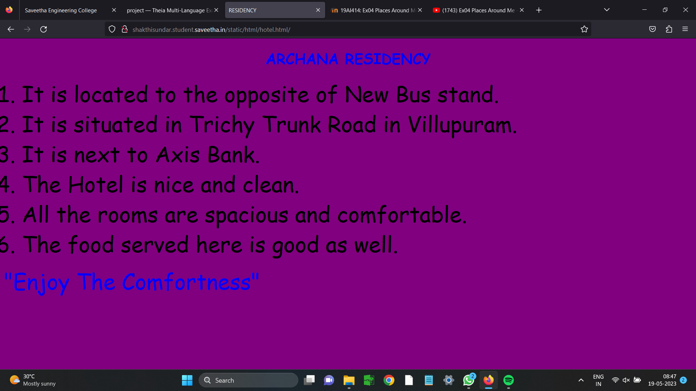
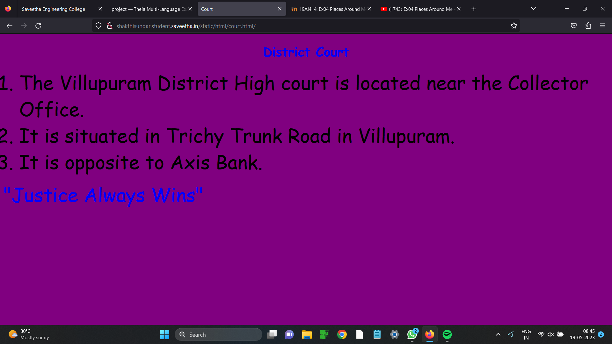
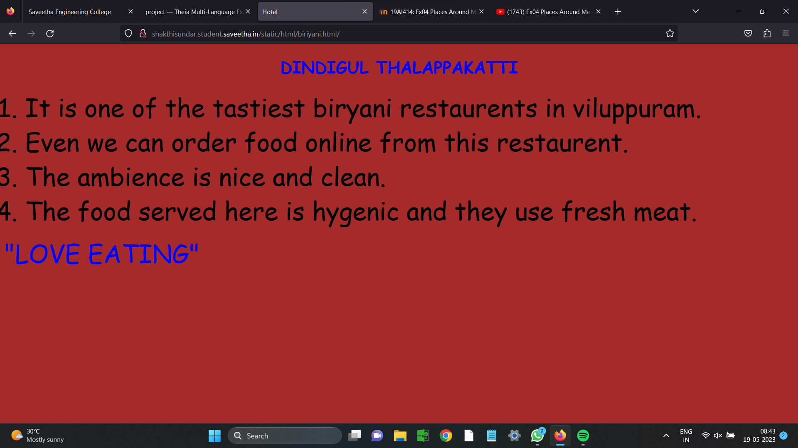
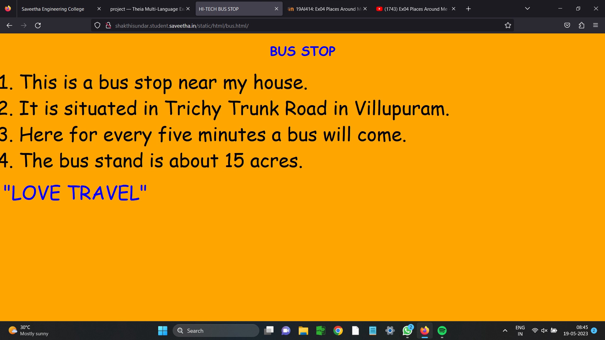
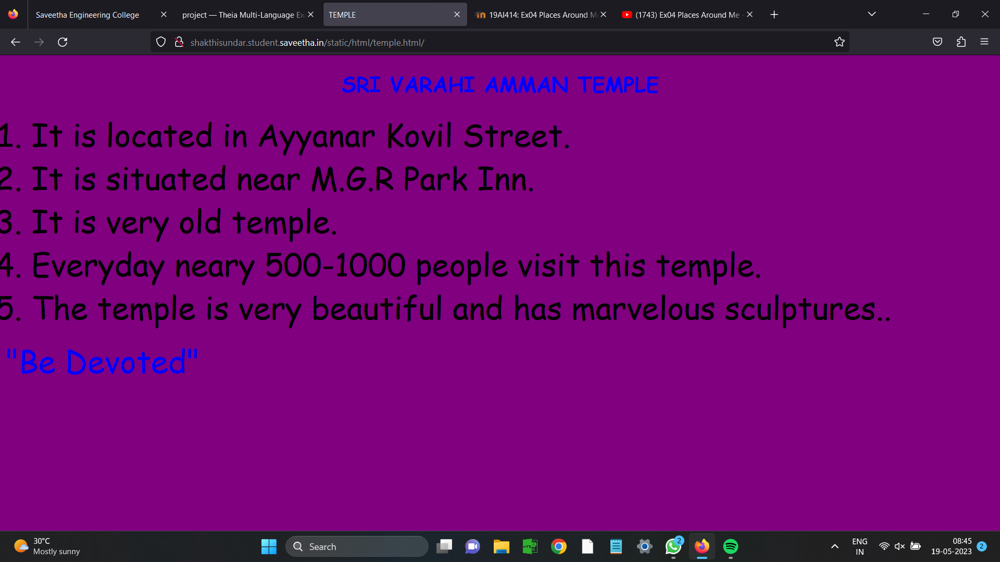

# Places Around Me
## AIM:
To develop a website to display details about the places around my house.

## Design Steps:

### Step 1:
Clone the github repository into Theia IDE.
### Step 2:
Create a new Django Project
### Step 2:
Write the needed HTML code.
### Step 2:
Run the Django server and execute the HTML files.
## Code:
map.html:
``` python
<!DOCTYPE html>
<html lang="en">
    <head>
        <title>MAT MAP</title>
    </head>
    <body>
        
        <MAP name="map">
             <AREA shape="RECT" coords="798,616,807,606"
                   href = "/static/html/bus.html/" Title="New Bus Stand" alt>
             <AREA shape="RECT" coords="1168,785,1180,777"
                   href = "/static/html/temple.html/" Title="Sri Varahi Amman Temple" alt>
             <AREA shape="RECT" coords="1004,559,1012,553"
                   href = "/static/html/hotel.html/" Title="Archana Residency" alt>
             <AREA shape="RECT"  coords="909,490,919,486"
                   href = "/static/html/court.html/"   Title="Vpm District Court" alt>
             <AREA shape="RECT"  coords="880,788,877,778"
                   href = "/static/html/biriyani.html/"  Title="Dindigul Thalapakkatti" alt>
         
        </MAP>

    </body>
</html>
```
bus.html:
``` python
<!DOCTYPE html>
<html lang="en">
<head>
    <title>
        HI-TECH BUS STOP
    </title>
</head>
<body bgcolor="orange" >
<h1 align="center">
    <font color="blue" face="cursive">
        BUS STOP
    </font>
</h1>
<p align="center">
    <font color="black" face="Comic Sans MS" size="24">
        <OL  TYPE="1" START="1">
            <LI> This is a bus stop near my house.<br></LI> 
            <LI>It is situated in Trichy Trunk Road in Villupuram.<br></LI>   
            <LI>Here for every five minutes a bus will come.<br></LI>
            <LI>The bus stand is about 15 acres.<br></LI>
        </OL>
    </font>
    <font color ="blue" face = "cursive" size="16" > 
    "LOVE TRAVEL"
    </font>
</p>
</body>
</html>
```
biriyani.html 
``` python
<!DOCTYPE html>
<html lang="en">
<head>
    <title>
        Hotel
    </title>
</head>
<body bgcolor="brown" >
<h1 align="center">
    <font color="blue" face="cursive">
        DINDIGUL THALAPPAKATTI
    </font>
</h1>
<p align="center">
    <font color="black" face="Comic Sans MS" size="24">
        <OL  TYPE="1" START="1">
            <LI>It is one of the tastiest biryani restaurents in viluppuram.<br></LI> 
            <LI>Even we can order food online from this restaurent.<br></LI>   
            <LI>The ambience is nice and clean.<br></LI>
            <LI>The food served here is hygenic and they use fresh meat.<br></LI>
        </OL>
    </font>
    <font color ="blue" face = "cursive" size="16" > 
    "LOVE EATING"
    </font>
</p>
</body>
</html>
```
court.html:
``` python
<!DOCTYPE html>
<html lang="en">
<head>
    <title>
        Court
    </title>
</head>
<body bgcolor="purple" >
<h1 align="center">
    <font color="blue" face="cursive">
        District Court
    </font>
</h1>
<p align="center">
    <font color="black" face="Comic Sans MS" size="24">
        <OL  TYPE="1" START="1">
            <LI> The Villupuram District High court is located near the Collector Office.<br></LI> 
            <LI>It is situated in Trichy Trunk Road in Villupuram.<br></LI>   
            <LI>It is opposite to Axis Bank.<br></LI>
            
        </OL>
    </font>
    <font color ="blue" face = "cursive" size="16" > 
    "Justice Always Wins"
    </font>
</p>
</body>
</html>
```
hotel.html:
``` python
<!DOCTYPE html>
<html lang="en">
<head>
    <title>
        RESIDENCY
    </title>
</head>
<body bgcolor="purple" >
<h1 align="center">
    <font color="blue" face="cursive">
        ARCHANA RESIDENCY
    </font>
</h1>
<p align="center">
    <font color="black" face="Comic Sans MS" size="24">
        <OL  TYPE="1" START="1">
            <LI>It is located to the opposite of New Bus stand.<br></LI> 
            <LI>It is situated in Trichy Trunk Road in Villupuram.<br></LI>   
            <LI>It is next to Axis Bank.<br></LI>
            <li>The Hotel is nice and clean.</li>
            <li>All the rooms are spacious and comfortable.</li>
            <li>The food served here is good as well.</li>
            
        </OL>
    </font>
    <font color ="blue" face = "cursive" size="16" > 
    "Enjoy The Comfortness"
    </font>
</p>
</body>
</html>
```
temple.html:
``` python
<!DOCTYPE html>
<html lang="en">
<head>
    <title>
        TEMPLE
    </title>
</head>
<body bgcolor="purple" >
<h1 align="center">
    <font color="blue" face="cursive">
        SRI VARAHI AMMAN TEMPLE
    </font>
</h1>
<p align="center">
    <font color="black" face="Comic Sans MS" size="24">
        <OL  TYPE="1" START="1">
            <LI>It is located in Ayyanar Kovil Street.<br></LI> 
            <LI>It is situated near M.G.R Park Inn.<br></LI>   
            <LI>It is very old temple.<br></LI>
            <li>Everyday neary 500-1000 people visit this temple.</li>
            <li>The temple is very beautiful and has marvelous sculptures..</li>
        
            
        </OL>
    </font>
    <font color ="blue" face = "cursive" size="16" > 
    "Be Devoted"
    </font>
</p>
</body>
</html>
```


## Output:
### Map output:

### Validator output:

### Output:





## Result:
The program for implementing image maps is executed successfully.